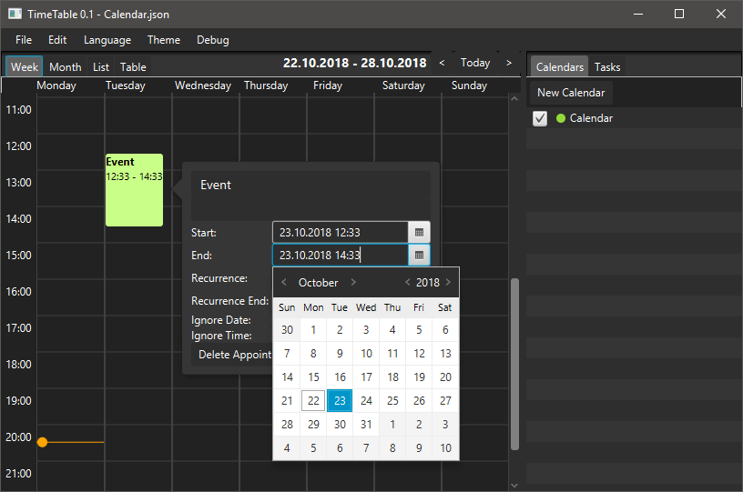

# TimeTable
A lightweight calendar application.

## Requirements
* Java 1.8+
* JavaFX

## Running
* `./gradlew app:run`

## Module Architecture
The application consists of multiple modules, some of which are bundled at compile-time.

| Module | Description |
| ------ | ----------- |
| app | The runnable application and the GUI |
| plugins | Runtime and Compile-time extensions |
| shared | Shared classes between the application and extensions |

| Plugin | Type | Description |
| ------ | ---- | ----------- |
| git | Bundled (compile-time) | A Git history browser |
| cau | Runtime JAR | A lecture browser for the University of Kiel |
| timer | Bundled (compile-time) | WIP |

To compile runtime plugins, the `jar` task is used:

`./gradlew plugins:cau:jar`

This will automatically generate the necessary `ServiceLoader` interfaces using Gradle. The plugin can then be added through the application using the plugin manager.
